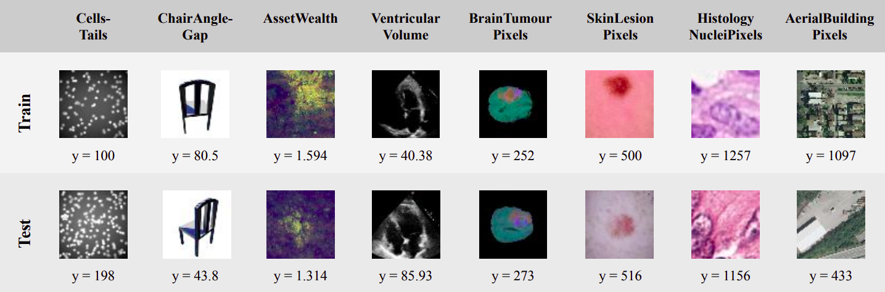

# regression_uncertainty



Official implementation (PyTorch) of the paper: \
**How Reliable is Your Regression Model's Uncertainty Under Real-World Distribution Shifts?**, 2023 [[arXiv]](https://arxiv.org/abs/2302.03679) [[project]](http://www.fregu856.com/publication/regression_uncertainty/). \
[Fredrik K. Gustafsson](http://www.fregu856.com/), [Martin Danelljan](https://martin-danelljan.github.io/), [Thomas B. Schön](http://user.it.uu.se/~thosc112/). \
_We propose an extensive benchmark for testing the reliability of regression uncertainty estimation methods under real-world distribution shifts. It consists of 8 publicly available image-based regression datasets with different types of challenging distribution shifts. We use our benchmark to evaluate many of the most common uncertainty estimation methods, as well as two state-of-the-art uncertainty scores from OOD detection. We find that while methods are well calibrated when there is no distribution shift, they all become highly overconfident on many of the benchmark datasets. This uncovers important limitations of current uncertainty estimation methods, and the proposed benchmark thus serves as a challenge to the research community._

If you find this work useful, please consider citing:
```
@inproceedings{gustafsson2023how,
  title={How Reliable is Your Regression Model's Uncertainty Under Real-World Distribution Shifts?},
  author={Gustafsson, Fredrik K and Danelljan, Martin and Sch{\"o}n, Thomas B},
  booktitle={Transactions on Machine Learning Research (TMLR)},
  year={2023}
}
```


***
***

## Datasets:

#### Cells:
- Download Cell200.zip from https://github.com/UBCDingXin/improved_CcGAN/tree/adb1f0cd56ff33e2127d1eee5053dac58e292a5c#1-datasets and extract.
- Move the resulting Cell200 folder to regression_uncertainty/datasets.
- Run Cells/create_datasets.py to generate the train, val and test splits.

#### Cells-Tails:
- Download Cell200.zip from https://github.com/UBCDingXin/improved_CcGAN/tree/adb1f0cd56ff33e2127d1eee5053dac58e292a5c#1-datasets and extract.
- Move the resulting Cell200 folder to regression_uncertainty/datasets.
- Run Cells-Tails/create_datasets.py to generate the train, val and test splits.

#### Cells-Gap:
- Download Cell200.zip from https://github.com/UBCDingXin/improved_CcGAN/tree/adb1f0cd56ff33e2127d1eee5053dac58e292a5c#1-datasets and extract.
- Move the resulting Cell200 folder to regression_uncertainty/datasets.
- Run Cells-Gap/create_datasets.py to generate the train, val and test splits.

#### ChairAngle:
- Download RC-49_64x64.h5 from https://github.com/UBCDingXin/improved_CcGAN#datasets.
- Move RC-49_64x64.h5 to regression_uncertainty/datasets.
- Run ChairAngle/create_datasets.py to generate the train, val and test splits.

#### ChairAngle-Tails:
- Download RC-49_64x64.h5 from https://github.com/UBCDingXin/improved_CcGAN#datasets.
- Move RC-49_64x64.h5 to regression_uncertainty/datasets.
- Run ChairAngle-Tails/create_datasets.py to generate the train, val and test splits.

#### ChairAngle-Gap:
- Download RC-49_64x64.h5 from https://github.com/UBCDingXin/improved_CcGAN#datasets.
- Move RC-49_64x64.h5 to regression_uncertainty/datasets.
- Run ChairAngle-Gap/create_datasets.py to generate the train, val and test splits.

#### AssetWealth:
- $ pip install wilds
- Run AssetWealth/create_datasets.py to download the dataset (13 GB).

#### VentricularVolume:
- Download EchoNet-Dynamic.zip from https://echonet.github.io/dynamic/index.html#dataset and extract.
- Move the resulting EchoNet-Dynamic folder to regression_uncertainty/datasets.
- Run VentricularVolume/create_datasets.py to generate the train, val and test splits.

#### BrainTumourPixels:
- Download Task01_BrainTumor.tar from http://medicaldecathlon.com/ and extract.
- Move the resulting Task01_BrainTumour folder to regression_uncertainty/datasets.
- Run BrainTumourPixels/create_datasets.py to generate the train, val and test splits.

#### SkinLesionPixels:
- Download the data from https://dataverse.harvard.edu/dataset.xhtml?persistentId=doi:10.7910/DVN/DBW86T (HAM10000_images_part_1.zip, HAM10000_images_part_2.zip, HAM10000_metadata, HAM10000_segmentations_lesion_tschandl.zip).
- Create the folder regression_uncertainty/datasets/ham10000.
- Move the files to regression_uncertainty/datasets/ham10000 and then extract.
- Run SkinLesionPixels/create_datasets.py to generate the train, val and test splits.

#### HistologyNucleiPixels:
- Download consep.zip from https://warwick.ac.uk/fac/cross_fac/tia/data/hovernet/ and extract.
- Download kumar.zip and tnbc.zip from https://drive.google.com/drive/folders/1l55cv3DuY-f7-JotDN7N5nbNnjbLWchK and extract.
- Create the folder regression_uncertainty/datasets/HistologyNucleiPixels.
- Move the resulting CoNSeP, kumar and tnbc folders to regression_uncertainty/datasets/HistologyNucleiPixels.
- Run HistologyNucleiPixels/create_datasets.py to generate the train, val and test splits.

#### AerialBuildingPixels:
- Download the data from https://project.inria.fr/aerialimagelabeling/ and extract.
- Move the resulting AerialImageDataset folder to regression_uncertainty/datasets.
- Run AerialBuildingPixels/create_datasets.py to generate the train, val and test splits.
